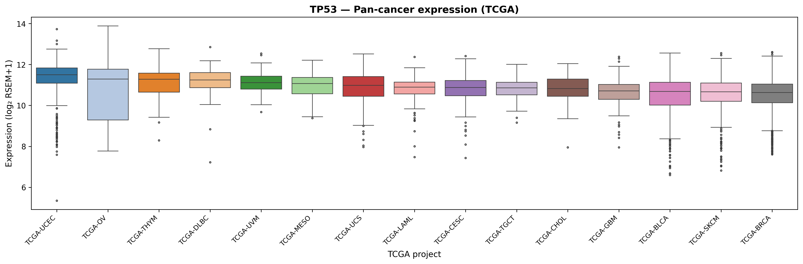
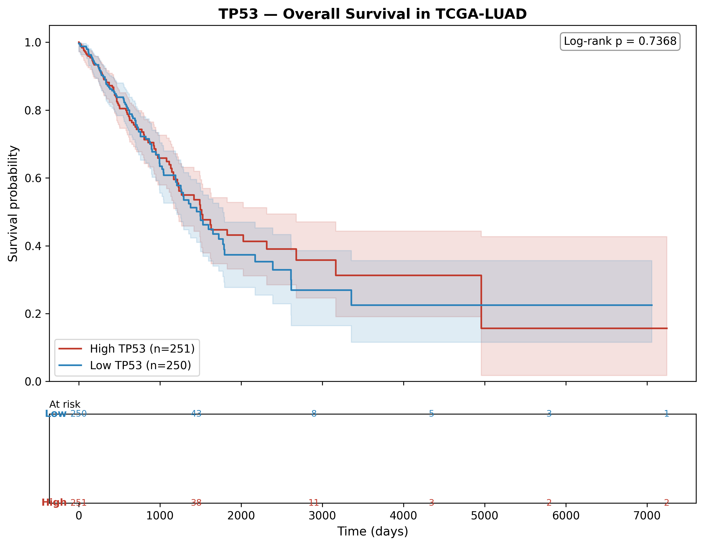

# genomics-skills

> **A modular, agent-friendly genomics skill library.**  
> 8 pure-Python skills · SKILL.md contracts · real TCGA data via cBioPortal · AI-powered skill routing · compatible with bioinfor-claw, OpenClaw, Claude Code, or any custom agent.

[](https://www.python.org/downloads/)
[](LICENSE)
[](skills/)
[](tests/)
[]()

---

## Why this repo exists

My flagship project [**agentic-genomics**](https://github.com/ankurgenomics/agentic-genomics) focuses on the **variant → clinical interpretation** chain: a LangGraph agent that takes a VCF + HPO phenotype terms and returns ranked, explainable candidate variants with ACMG-lite evidence chains.

Once the top candidate genes are identified, a researcher inevitably asks follow-up questions:

> *"What does expression of this gene look like across TCGA cancer types?"*  
> *"Is high expression prognostic in LUAD?"*  
> *"Where does this missense land on the 3-D structure?"*  
> *"What did the last 5 papers say about this variant?"*

This repo is the **downstream skill layer** that answers those questions — deterministic, agent-callable, output-compatible, and independently useful.

Each skill is:
- A **self-contained Python script** with explicit `argparse` flags
- Documented by a **SKILL.md** (purpose · inputs · outputs · trigger phrases · execution policy)
- Backed by **real data** from public APIs (cBioPortal, MyVariant.info, UniProt, NCBI) — no synthetic samples
- Compatible with [bioinfor-claw](https://github.com/MDhewei/bioinfor-claw), OpenClaw, Claude Code, or any agent that scans `SKILL.md` files
- Callable directly from the CLI, a Snakemake rule, or a Nextflow process — no agent required

---

## Example outputs

### Pan-cancer expression — TP53 across 31 TCGA projects (9,479 real samples)



*Data: TCGA Pan-Cancer Atlas 2018 · RNA-seq v2 RSEM via cBioPortal REST API · log₂(RSEM+1)*

---

### Kaplan-Meier survival — TP53 expression in TCGA-LUAD (501 patients)



*High vs. low expression split at median · Overall survival · log-rank p-value shown*

---

## Skill catalog

| # | Skill | Scenario | Key outputs |
|---|-------|----------|-------------|
| 1 | [`variant-context`](skills/variant-context/) | Variant annotation | Mutation lollipop plot, hotspot TSV, somatic frequency bar chart |
| 2 | [`protein-variant-mapper`](skills/protein-variant-mapper/) | Protein structure | 3-D HTML viewer with labeled variants, lollipop map PNG |
| 3 | [`protein-structure-viewer`](skills/protein-structure-viewer/) | Protein structure | Interactive 3-D viewer HTML, pocket TSV, B-factor plot |
| 4 | [`tcga-expression`](skills/tcga-expression/) | Gene expression | Pan-cancer expression TSV + box plots (9,479 samples · 31 cancers) |
| 5 | [`survival-analysis`](skills/survival-analysis/) | Survival | KM curves PNG/SVG, log-rank p-value, at-risk table, survival TSV |
| 6 | [`go-enrichment`](skills/go-enrichment/) | Gene-list analysis | GO/KEGG enrichment TSV, bubble plot PNG |
| 7 | [`pubmed-search`](skills/pubmed-search/) | Literature | Results TSV, markdown digest, keyword + timeline plots |
| 8 | [`plot-volcano`](skills/plot-volcano/) | Publication figures | 300 DPI PNG + SVG, annotated TSV, quadrant counts |

---

## Architecture

```
genomics-skills/
│
├── skills/                          ← one directory per skill
│   ├── tcga-expression/
│   │   ├── SKILL.md                 ← agent-readable contract
│   │   ├── scripts/
│   │   │   └── tcga_expression.py   ← pure-Python, cBioPortal REST API
│   │   └── requirements.txt
│   ├── survival-analysis/
│   ├── variant-context/
│   ├── protein-variant-mapper/
│   ├── protein-structure-viewer/
│   ├── go-enrichment/
│   ├── pubmed-search/
│   └── plot-volcano/
│
├── src/genomics_skills/             ← installable Python package
│   ├── cli.py                       ← `genomics-skill run/list/info/suggest`
│   └── runner.py                    ← skill discovery + LLM-backed routing
│
├── examples/                        ← example output images (tracked in git)
├── tests/                           ← pytest suite (14 tests)
├── docs/
│   ├── skill-authoring-guide.md
│   └── integration-guide.md
└── pyproject.toml
```

---

## Quick start

```bash
# 1. Clone and install
git clone https://github.com/ankurgenomics/genomics-skills.git
cd genomics-skills
python -m venv .venv && source .venv/bin/activate
pip install -e ".[all]"

# 2. Set env vars (only needed for pubmed-search and AI skill routing)
cp .env.example .env
# edit .env: set NCBI_EMAIL, optionally ANTHROPIC_API_KEY

# 3. Run a skill directly
python skills/tcga-expression/scripts/tcga_expression.py \
    --gene TP53 --mode pan-cancer --outdir results/

# 4. Or via the CLI
genomics-skill run tcga-expression --gene TP53 --mode pan-cancer

# 5. List all available skills
genomics-skill list

# 6. Use AI to find the right skill (requires ANTHROPIC_API_KEY)
genomics-skill suggest "show gene expression across cancer types"
```

---

## CLI reference

```
genomics-skill list                          # list all discovered skills
genomics-skill info <skill-name>             # show SKILL.md for a skill
genomics-skill run  <skill-name> [args...]   # run a skill by name
genomics-skill suggest "<natural language>"  # AI-powered skill routing (Claude Haiku)
```

### Example runs

```bash
# Pan-cancer expression for BRCA1
genomics-skill run tcga-expression --gene BRCA1 --mode pan-cancer --outdir results/

# Tumor-vs-normal for EGFR in LUSC
genomics-skill run tcga-expression --gene EGFR --mode tumor-vs-normal --cancer LUSC --outdir results/

# Kaplan-Meier overall survival for KRAS in colorectal cancer
genomics-skill run survival-analysis --gene KRAS --cancer TCGA-COAD --endpoint os --outdir results/

# Variant annotation for TP53
genomics-skill run variant-context --gene TP53 --variant "R175H" --cancer LUAD --outdir results/

# PubMed search
genomics-skill run pubmed-search --query "BRCA1 homologous recombination" --max-results 20 --outdir results/

# AI skill routing
genomics-skill suggest "what does KRAS expression look like in pancreatic cancer?"
```

---

## Data sources

| Skill | Data source | Notes |
|---|---|---|
| `tcga-expression` | [cBioPortal REST API](https://www.cbioportal.org/api) | TCGA Pan-Cancer Atlas 2018 · RNA-seq v2 RSEM · 9,479 samples · 31 cancers |
| `survival-analysis` | [cBioPortal REST API](https://www.cbioportal.org/api) | OS/DFS clinical data merged with expression |
| `variant-context` | [MyVariant.info](https://myvariant.info) | Somatic variant frequency + hotspot annotation |
| `protein-variant-mapper` | [UniProt](https://www.uniprot.org) + [AlphaFold](https://alphafold.ebi.ac.uk) | Variant-to-3D structure mapping |
| `protein-structure-viewer` | [RCSB PDB](https://www.rcsb.org) | Interactive structure + pocket detection |
| `pubmed-search` | [NCBI E-utilities](https://www.ncbi.nlm.nih.gov/books/NBK25497/) + Europe PMC | Requires `NCBI_EMAIL` in `.env` |
| `go-enrichment` | [g:Profiler REST API](https://biit.cs.ut.ee/gprofiler/) | GO/KEGG enrichment, no auth needed |
| `plot-volcano` | Local (user-provided TSV) | Gene-level DE results as input |

Results are **Parquet-cached** at `~/.cache/genomics-skills/` — subsequent runs with the same gene are instant.

---

## How to use with agentic-genomics

```
proband.vcf + HPO terms
        │
        ▼
  agentic-genomics (GenomicsCopilot)
  → ranked variants + ACMG-lite evidence
        │
        ▼  top candidate genes
  genomics-skills (OmicsContextAgent)
  → tcga-expression       → is this gene dysregulated in relevant cancer type?
  → survival-analysis     → is expression prognostic?
  → variant-context       → somatic hotspot landscape in TCGA
  → protein-variant-mapper → 3-D structure with the patient variant labeled
  → go-enrichment         → pathway context for co-expression partners
  → pubmed-search         → recent literature for the gene + variant
        │
        ▼
  Consolidated research report (markdown + figures)
```

See [`docs/integration-guide.md`](docs/integration-guide.md) for the LangGraph wiring.

---

## How to use with bioinfor-claw / OpenClaw / Claude Code

Because every skill ships a `SKILL.md`, it is auto-discoverable by any compatible agent:

```bash
# Register via OpenClaw extraDirs (edit ~/.openclaw/openclaw.json):
{ "skills": { "load": { "extraDirs": ["/path/to/genomics-skills/skills"] } } }

# Or launch Claude Code from repo root — it scans SKILL.md automatically
cd genomics-skills && claude
```

---

## Design principles

1. **One purpose per skill.** Each skill solves a single, well-scoped problem.
2. **SKILL.md is the contract.** Inputs, outputs, defaults, failure conditions, and trigger phrases — readable by both humans and agents.
3. **Real data only.** All skills fetch from live public APIs. No synthetic or placeholder data.
4. **Pure Python, no R.** numpy / pandas / matplotlib / scipy / lifelines / biopython stack only.
5. **Stable output formats.** TSV, PNG/SVG, JSON manifests. Designed for downstream chaining.
6. **Agents reason, skills compute.** Skills are deterministic executors. Judgment belongs to the agent layer.
7. **Research-grade, not clinical-grade.**

---

## Running tests

```bash
pytest tests/ -v   # → 14 passed
```

---

## Roadmap

| Skill | Status | Notes |
|-------|--------|-------|
| `variant-context` | 🟢 MVP | Mutation lollipop + hotspot from MyVariant.info |
| `protein-variant-mapper` | �� MVP | Map variants onto AlphaFold / PDB 3-D structure |
| `protein-structure-viewer` | 🟢 MVP | Interactive HTML viewer, pocket detection |
| `tcga-expression` | 🟢 Live data | 9,479 samples · 31 cancers · cBioPortal Pan-Cancer Atlas 2018 |
| `survival-analysis` | 🟢 Live data | KM + Cox from real TCGA clinical + expression data |
| `go-enrichment` | 🟢 MVP | GO/KEGG enrichment via g:Profiler REST API |
| `pubmed-search` | 🟢 MVP | PubMed E-utilities + citation trends |
| `plot-volcano` | 🟢 MVP | Publication-quality volcano (300 DPI PNG + SVG) |
| `crispr-sgrna-design` | 🔵 Planned | SpCas9 sgRNA design for candidate genes |
| `coexpression-network` | 🔵 Planned | STRING PPI + co-expression network |
| `depmap-essentiality` | 🔵 Planned | DepMap dependency profiling for candidate genes |
| `single-cell-marker` | 🔵 Planned | scRNA-seq marker gene context |

---

## Author

**Ankur Sharma** — AI · ML · Bioinformatics · Genomics  
[GitHub: @ankurgenomics](https://github.com/ankurgenomics) · [agentic-genomics](https://github.com/ankurgenomics/agentic-genomics)

---

## License

MIT — see [LICENSE](LICENSE).

> ⚠️ **Research demonstration only.** Not for clinical use. Not a medical device.  
> Skills use public APIs (cBioPortal, MyVariant.info, UniProt, NCBI) — check their individual terms of use.
